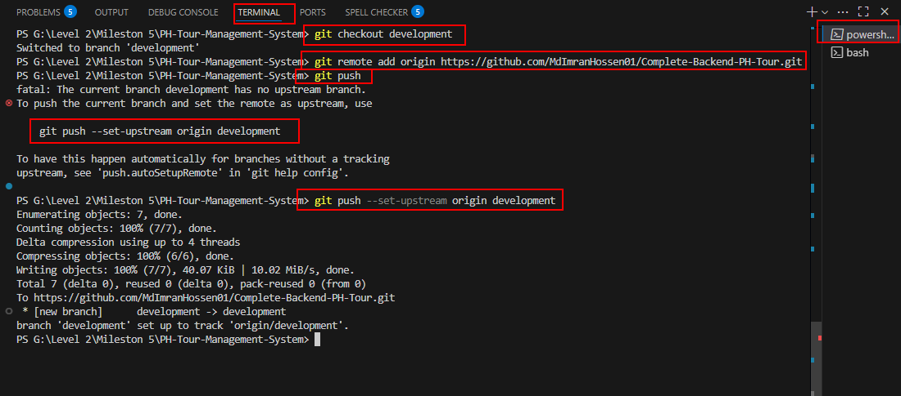
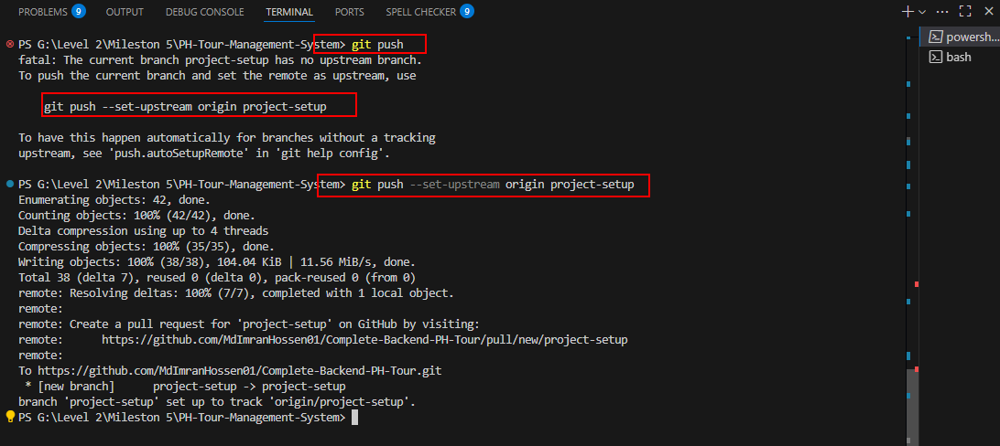

# Github
- create public repository
- switch development branch
- **follow the steps**

- switch to project setup branch

- refresh the repository
- select `project setup` branch from dropdown
- click `pull requests` tab
- click `new pull request`
- select `project setup` from `compare` dropdown
- click on `create pull request`
- modify title if needed and then click `create pull request`
- click `conversation tab` then click `merge pull request` then  click`confirm merge`
- then switch to `development` branch
- run
```
git pull origin development
```
- create new branch from development branch
```
git checkout -b part-1
```
---