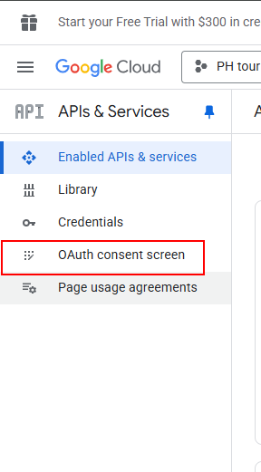

# Google Authentication

[passport js documentation](https://www.passportjs.org/)

- find oauth for google authentication [passport-google-oauth20](https://www.passportjs.org/packages/passport-google-oauth20/)
- find local for local authentication [passport local](https://www.passportjs.org/packages/passport-local/)
- Go to google cloud api and services then create a project [create project](https://console.cloud.google.com/projectselector2/apis/dashboard?inv=1&invt=Ab3v0w&organizationId=0&supportedpurview=project)

- click



- then click on `get started` button
- Create app
- then click on `Create Oauth client`
- Select `Web application` create name, add uri `http://localhost:5000`
- Add `http://localhost:5000/api/v1/auth/google/callback` to authorized redirect uris
- Copy `client secret`, `client id`, `call uri` and  place it to `.env` file 
- install packages
```
npm install passport passport-local passport-google-oauth20
npm i -D @types/passport @types/passport-local @types/passport-google-oauth20
```
```
npm i express-session
npm i --save-dev @types/express-session
```
### Create `passport.ts` at `src/app/config/passport.ts`
```ts
/* eslint-disable @typescript-eslint/no-explicit-any */
import passport from "passport";
import { Strategy as GoogleStrategy, Profile, VerifyCallback } from "passport-google-oauth20";
import { Role } from "../modules/user/user.interface";
import { User } from "../modules/user/user.model";
import { envVars } from "./env";


passport.use(
    new GoogleStrategy(
        {
            clientID: envVars.GOOGLE_CLIENT_ID,
            clientSecret: envVars.GOOGLE_CLIENT_SECRET,
            callbackURL: envVars.GOOGLE_CALLBACK_URL
        }, async (accessToken: string, refreshToken: string, profile: Profile, done: VerifyCallback) => {

            try {
                const email = profile.emails?.[0].value;

                if (!email) {
                    return done(null, false, { mesaage: "No email found" })
                }

                let user = await User.findOne({ email })

                if (!user) {
                    user = await User.create({
                        email,
                        name: profile.displayName,
                        picture: profile.photos?.[0].value,
                        role: Role.USER,
                        isVerified: true,
                        auths: [
                            {
                                provider: "google",
                                providerId: profile.id
                            }
                        ]
                    })
                }

                return done(null, user)


            } catch (error) {
                console.log("Google Strategy Error", error);
                return done(error)
            }
        }
    )
)

// frontend localhost:5173/login?redirect=/booking -> localhost:5000/api/v1/auth/google?redirect=/booking -> passport -> Google OAuth Consent -> gmail login -> successful -> callback url localhost:5000/api/v1/auth/google/callback -> db store -> token

// Bridge == Google -> user db store -> token
//Custom -> email , password, role : USER, name... -> registration -> DB -> 1 User create
//Google -> req -> google -> successful : Jwt Token : Role , email -> DB - Store -> token - api access


passport.serializeUser((user: any, done: (err: any, id?: unknown) => void) => {
    done(null, user._id)
})

passport.deserializeUser(async (id: string, done: any) => {
    try {
        const user = await User.findById(id);
        done(null, user)
    } catch (error) {
        console.log(error);
        done(error)
    }
})
```

### check this link. it will redirect to google consent
```
http://localhost:5000/api/v1/auth/google/
``` 


