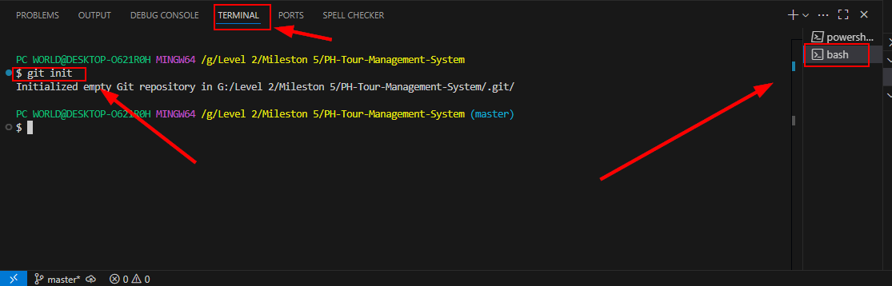
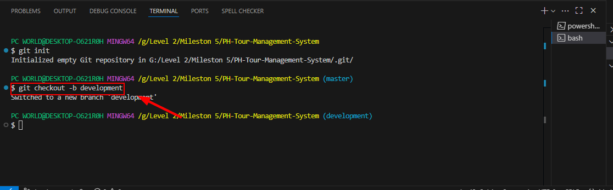

# Tour Management System - Backend Documentation

This project was developed as part of the Apollo Level 2 Web Development course. Below are the links to all important project-related documentation.

---

### 📋 Project Planning & Analysis

-   **Requirement Analysis:** [Detailed description of the project's requirements and features](https://docs.google.com/document/d/1XRN18ClObPMJGKl7CfZFBLeZuJf2h8JOBc_crzuWtT4/edit?tab=t.0)
-   **System Workflow:** [Visual diagram of the system's workflow](https://gitmind.com/app/docs/mzkbj5o2)

---

### 🗃️ Database Design

-   **Data Modelling:** [Description of the system's data model and schema](https://docs.google.com/document/d/1NSELQ7_jUx4xLGchef4HT3_9YqDWrdzUUGMZWmD2lY0/edit?tab=t.0)
-   **ER Diagram:** [Entity-Relationship Diagram (ERD)](https://drive.google.com/file/d/1ASphx7B6gHIKPiiiNf3AB_ZTvdYRBsQz/view?usp=sharing)

---

### ⚙️ API & Source Code

-   **API Endpoints:** [List and description of all project API endpoints](https://docs.google.com/document/d/1HysoioRCpSsGpSz8JQZRGii9GNkpdx0pEX-zHP2p334/edit?tab=t.0)
-   **GitHub Repository:** [The complete source code for the project](https://github.com/Apollo-Level2-Web-Dev/ph-tour-management-system-backend)

---
---

# Setup project & Github

- Create a folder for the project and rename. 
- Open In Vs Code
- In terminal write `git init`

- Create `.gitignore` file in project folder

```javascript 
node_modules
```
### Change git branch
- type `git checkout -b development` in terminal to switch development branch

---